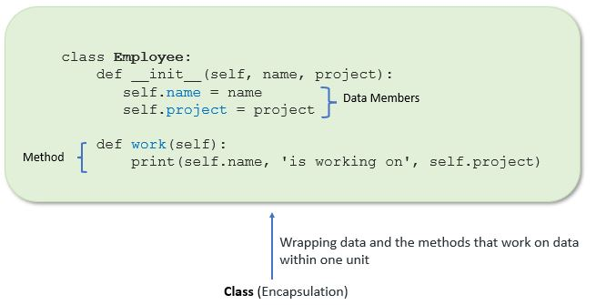
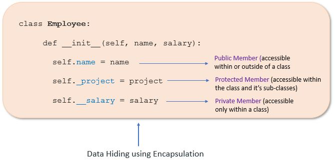

# Object Oriebted Programming Concepts

## OOP/OOPs (object oriented programming system) 

*Object-oriented programming (OOP) is a computer programming model that organizes software design around data, or objects, rather than functions and logic. An object can be defined as a data field that has unique attributes and behavior.*

- OOPS is a programming paradigm based on the concept of "objects", and that contain code and data
- OOP is a method that arranges software design around data or object
- There are many Object-oriented programming languages including Java, c++, Python, and javascript
- In OOP computer programs are designed to make objects interact with each other
- The first step in OOP is to collect all objects to manipulate and identify how they relate to each other
- programming is well suited for programs that are large, complex, and activity updated and maintained
- OOP benefits collaborative development, where projects are separated into groups.
- once the object is known then it labels as a class of object


## the structure of object-oriented programming

*The structure, or building blocks, of object-oriented programming include the following:*

- **Classes** are user-defined data types that act as the blueprint for individual objects, attributes and methods.
- **Objects** are instances of a class created with specifically defined data. Objects can correspond to real-world objects or an abstract entity. When class is defined initially, the description is the only object that is defined.
- **Methods** are functions that are defined inside a class that describe the behaviors of an object. Each method contained in class definitions starts with a reference to an instance object. Additionally, the subroutines contained in an object are called instance methods. Programmers use methods for reusability or keeping functionality encapsulated inside one object at a time.
- **Attributes** are defined in the class template and represent the state of an object. Objects will have data stored in the attributes field. Class attributes belong to the class itself.


## Class

- Classes are defined by the user
- Classes acts as bluepribt for object, attribute and methods
- A class is consist of declaration and defination
- Class is created using the class keyword
- Classes are used to create and manage new object and support inheritance 


**Syntax:**

```python
class classname:
    '''documentation string'''
    class_suite
```
* **Documentation string:** represent a description of the class. It is optional.
* **class_suite:** class suite contains component statements, variables, methods, functions, attributes.

The example for class of parrot can be :

```python
class Parrot:
    pass
```

Here, we use the **`class`** keyword to define an empty class **`Parrot`**. From class, we construct instances. An instance is a specific object created from a particular class.

```python
class Person:
    pass
print(Person)
```


## Object

- Objects are instances of a class
- Objects are created with specific data
- Objects provides a structured approach to programming
- We can easily create multiple similar object and modify existing object 
- Object in OOP's can include a data structure, a vartiable or function

**Syntax:**

```python
reference_variable = classname()
```

The example for object of parrot class can be:

```python
obj = Parrot()
```

Here, **`obj`** is an **`object`** of class Parrot.

Suppose we have details of parrots. Now, we are going to show how to build the class and objects of parrots.

```python
p = Person()
print(p)
```
# Example 1: We can create an object by calling the class

```python
p = Person()
print(p)
```
# Example 2: Creating Class and Object in Python

```python
class Student:
    """This is student class with data"""    
    def learn(self):    # A sample method
        print("Welcome to Guranna Gouda's class on Python Programming")

stud = Student()        # creating object
stud.learn()            # Calling method
```
### Output: Welcome to Guranna Gouda's class on Python Programming

#How to insert Value Using Construct
```python
class Student:
    """This is student class with data"""    
    def __init__(self, name):
        self.name = name
    
    def learn(self):
        print(f"Welcome, {self.name}, to Guranna Gouda's class on Python Programming")

# Creating an object with a specified name
stud = Student(name="Guru")
stud.learn()
```

## Class Constructor

In the examples above, we have created an object from the **`Person`** class. However, a class without a constructor is not really useful in real applications. Let us use constructor function to make our class more useful. Like the constructor function in Java or JavaScript, Python has also a built-in **`__init__()`** constructor function. The **`__init__()`** constructor function has **`self`** parameter which is a reference to the current instance of the class.

The **`__init__()`**  method in Python is a special method, also known as the constructor, and it is automatically called when an object is created from a class. Its primary purpose is to initialize the attributes of the object.

```python
class Person:
      def __init__ (self, name):
        # self allows to attach parameter to the class
          self.name =name

p = Person('Eren')
print(p.name)
print(p)
```
# Example 1: add more parameters to the constructor function.
```python
class Person:
      def __init__(self, firstname, lastname, age, country, city):
            self.firstname = firstname
            self.lastname = lastname
            self.age = age
            self.country = country
            self.city = city

p = Person('Guru', 'Patil', 22, 'India', 'Bengaluru')
print(p.firstname)
print(p.lastname)
print(p.age)
print(p.country)
print(p.city)
```
```python
#output
# Guru
# Patil
# 22
# India
# Bengaluru
```


> here in this example class in animal and objects are dog,cat,cow,elephant

> each object has its own identity attribute and behaviour

> every object contain real-life entities


## the main principles of OOP

*Object-oriented programming is based on the following principles:*

- **Encapsulation.** This principle states that all important information is contained inside an object and only select information is exposed. The implementation and state of each object are privately held inside a defined class. Other objects do not have access to this class or the authority to make changes. They are only able to call a list of public functions or methods. This characteristic of data hiding provides greater program security and avoids unintended data corruption.
  


```python
class Employee:
    # constructor
    def __init__(self, name, salary, project):
        # data members
        self.name = name
        self.salary = salary
        self.project = project

    # method
    # to display employee's details
    def show(self):
        # accessing public data member
        print("Name: ", self.name, 'Salary:', self.salary)

    # method
    def work(self):
        print(self.name, 'is working on', self.project)

# creating object of a class
emp = Employee('Jessa', 8000, 'NLP')

# calling public method of the class
emp.show()
emp.work()
```
```python
- Output
Name:  Jessa Salary: 8000
Jessa is working on NLP
```

# Access Modifiers in Python
Encapsulation can be achieved by declaring the data members and methods of a class either as private or protected. But In Python, we don’t have direct access modifiers like public, private, and protected. We can achieve this by using single underscore and double underscores.

Access modifiers limit access to the variables and methods of a class. Python provides three types of access modifiers private, public, and protected.

Public Member: Accessible anywhere from otside oclass.
Private Member: Accessible within the class
Protected Member: Accessible within the class and its sub-classes

-**Public Member**
Public data members are accessible within and outside of a class. All member variables of the class are by default public.
```python
class Employee:
    # constructor
    def __init__(self, name, salary):
        # public data members
        self.name = name
        self.salary = salary

    # public instance methods
    def show(self):
        # accessing public data member
        print("Name: ", self.name, 'Salary:', self.salary)

# creating object of a class
emp = Employee('Jessa', 10000)

# accessing public data members
print("Name: ", emp.name, 'Salary:', emp.salary)

# calling public method of the class
emp.show()
```
```python
Name:  Jessa Salary: 10000
Name:  Jessa Salary: 10000
```

-**Private Member**
We can protect variables in the class by marking them private. To define a private variable add two underscores as a prefix at the start of a variable name.

Private members are accessible only within the class, and we can’t access them directly from the class objects.

```python
class Employee:
    # constructor
    def __init__(self, name, salary):
        # public data member
        self.name = name
        # private member
        self.__salary = salary

# creating object of a class
emp = Employee('Jessa', 10000)

# accessing private data members
print('Salary:', emp.__salary)

-output
AttributeError: 'Employee' object has no attribute '__salary'
```

```python

class Employee:
    # constructor
    def __init__(self, name, salary):
        # public data member
        self.name = name
        # private member
        self.__salary = salary

# creating object of a class
emp = Employee('Jessa', 10000)

print('Name:', emp.name)
# direct access to private member using name mangling
print('Salary:', emp._Employee__salary)

-output
Name: Jessa
Salary: 10000
```
- **Protected Member.**
Protected members are accessible within the class and also available to its sub-classes. To define a protected member, prefix the member name with a single underscore _.

Protected data members are used when you implement inheritance and want to allow data members access to only child classes.
```python
# base class
class Company:
    def __init__(self):
        # Protected member
        self._project = "NLP"

# child class
class Employee(Company):
    def __init__(self, name):
        self.name = name
        Company.__init__(self)

    def show(self):
        print("Employee name :", self.name)
        # Accessing protected member in child class
        print("Working on project :", self._project)

c = Employee("Jessa")
c.show()

# Direct access protected data member
print('Project:', c._project)

-output
Employee name : Jessa
Working on project : NLP
Project: NLP

```
-**Getters and Setters in Python**
To implement proper encapsulation in Python, we need to use setters and getters. The primary purpose of using getters and setters in object-oriented programs is to ensure data encapsulation. Use the getter method to access data members and the setter methods to modify the data members.

In Python, private variables are not hidden fields like in other programming languages. The getters and setters methods are often used when:

When we want to avoid direct access to private variables
To add validation logic for setting a value
```python
class Student:
    def __init__(self, name, age):
        # private member
        self.name = name
        self.__age = age

    # getter method
    def get_age(self):
        return self.__age

    # setter method
    def set_age(self, age):
        self.__age = age

stud = Student('Jessa', 14)

# retrieving age using getter
print('Name:', stud.name, stud.get_age())

# changing age using setter
stud.set_age(16)

# retrieving age using getter
print('Name:', stud.name, stud.get_age())

-Output
Name: Jessa 14
Name: Jessa 16
```



- **Abstraction.** Objects only reveal internal mechanisms that are relevant for the use of other objects, hiding any unnecessary implementation code. The derived class can have its functionality extended. This concept can help developers more easily make additional changes or additions over time.


- **Inheritance.** Classes can reuse code from other classes. Relationships and subclasses between objects can be assigned, enabling developers to reuse common logic while still maintaining a unique hierarchy. This property of OOP forces a more thorough data analysis, reduces development time and ensures a higher level of accuracy.


- **Polymorphism.** Objects are designed to share behaviors and they can take on more than one form. The program will determine which meaning or usage is necessary for each execution of that object from a parent class, reducing the need to duplicate code. A child class is then created, which extends the functionality of the parent class. Polymorphism allows different types of objects to pass through the same interface.


## the benefits of OOP

*Benefits of OOP include:*

- **Modularity.** Encapsulation enables objects to be self-contained, making troubleshooting and collaborative development easier.
- **Reusability.** Code can be reused through inheritance, meaning a team does not have to write the same code multiple times.
- **Productivity.** Programmers can construct new programs quicker through the use of multiple libraries and reusable code.
- **Easily upgradable and scalable.** Programmers can implement system functionalities independently.
- **Interface descriptions.** Descriptions of external systems are simple, due to message passing techniques that are used for objects communication.
- **Security.** Using encapsulation and abstraction, complex code is hidden, software maintenance is easier and internet protocols are protected.
- **Flexibility.** Polymorphism enables a single function to adapt to the class it is placed in. Different objects can also pass through the same interface.
