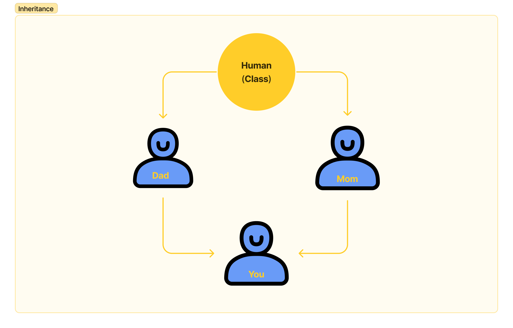

# Object Oriebted Programming Concepts

## OOP/OOPs (object oriented programming system) 

*Object-oriented programming (OOP) is a computer programming model that organizes software design around data, or objects, rather than functions and logic. An object can be defined as a data field that has unique attributes and behavior.*

- OOPS is a programming paradigm based on the concept of "objects", and that contain code and data
- OOP is a method that arranges software design around data or object
- There are many Object-oriented programming languages including Java, c++, Python, and javascript
- In OOP computer programs are designed to make objects interact with each other
- The first step in OOP is to collect all objects to manipulate and identify how they relate to each other
- programming is well suited for programs that are large, complex, and activity updated and maintained
- OOP benefits collaborative development, where projects are separated into groups.
- once the object is known then it labels as a class of object

## the structure of object-oriented programming

*The structure, or building blocks, of object-oriented programming include the following:*

- **Classes** are user-defined data types that act as the blueprint for individual objects, attributes and methods.
- **Objects** are instances of a class created with specifically defined data. Objects can correspond to real-world objects or an abstract entity. When class is defined initially, the description is the only object that is defined.
- **Methods** are functions that are defined inside a class that describe the behaviors of an object. Each method contained in class definitions starts with a reference to an instance object. Additionally, the subroutines contained in an object are called instance methods. Programmers use methods for reusability or keeping functionality encapsulated inside one object at a time.
- **Attributes** are defined in the class template and represent the state of an object. Objects will have data stored in the attributes field. Class attributes belong to the class itself.

## Class

- Classes are defined by the user
- Classes acts as bluepribt for object, attribute and methods
- A class is consist of declaration and defination
- Class is created using the class keyword
- Classes are used to create and manage new object and support inheritance 

## Object

- Objects are instances of a class
- Objects are created with specific data
- Objects provides a structured approach to programming
- We can easily create multiple similar object and modify existing object 
- Object in OOP's can include a data structure, a vartiable or function

> here in this example class in animal and objects are dog,cat,cow,elephant

> each object has its own identity attribute and behaviour

> every object contain real-life entities

## the main principles of OOP

*Object-oriented programming is based on the following principles:*

- **Encapsulation.** This principle states that all important information is contained inside an object and only select information is exposed. The implementation and state of each object are privately held inside a defined class. Other objects do not have access to this class or the authority to make changes. They are only able to call a list of public functions or methods. This characteristic of data hiding provides greater program security and avoids unintended data corruption.

- **Abstraction.** Objects only reveal internal mechanisms that are relevant for the use of other objects, hiding any unnecessary implementation code. The derived class can have its functionality extended. This concept can help developers more easily make additional changes or additions over time.

- **Inheritance.** Classes can reuse code from other classes. Relationships and subclasses between objects can be assigned, enabling developers to reuse common logic while still maintaining a unique hierarchy. This property of OOP forces a more thorough data analysis, reduces development time and ensures a higher level of accuracy.

- **Polymorphism.** Objects are designed to share behaviors and they can take on more than one form. The program will determine which meaning or usage is necessary for each execution of that object from a parent class, reducing the need to duplicate code. A child class is then created, which extends the functionality of the parent class. Polymorphism allows different types of objects to pass through the same interface.

## the benefits of OOP

*Benefits of OOP include:*

- **Modularity.** Encapsulation enables objects to be self-contained, making troubleshooting and collaborative development easier.
- **Reusability.** Code can be reused through inheritance, meaning a team does not have to write the same code multiple times.
- **Productivity.** Programmers can construct new programs quicker through the use of multiple libraries and reusable code.
- **Easily upgradable and scalable.** Programmers can implement system functionalities independently.
- **Interface descriptions.** Descriptions of external systems are simple, due to message passing techniques that are used for objects communication.
- **Security.** Using encapsulation and abstraction, complex code is hidden, software maintenance is easier and internet protocols are protected.
- **Flexibility.** Polymorphism enables a single function to adapt to the class it is placed in. Different objects can also pass through the same interface.
